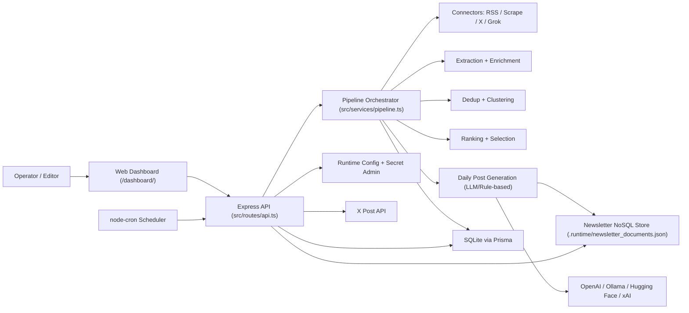
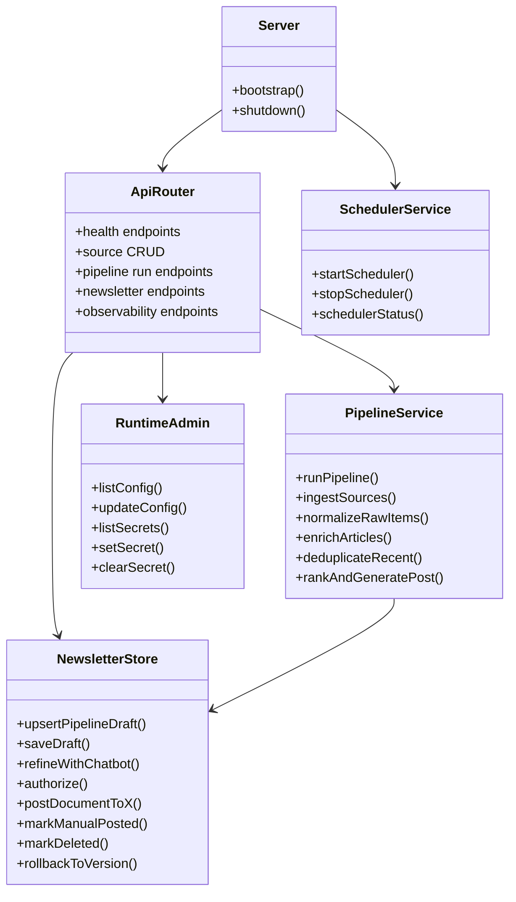
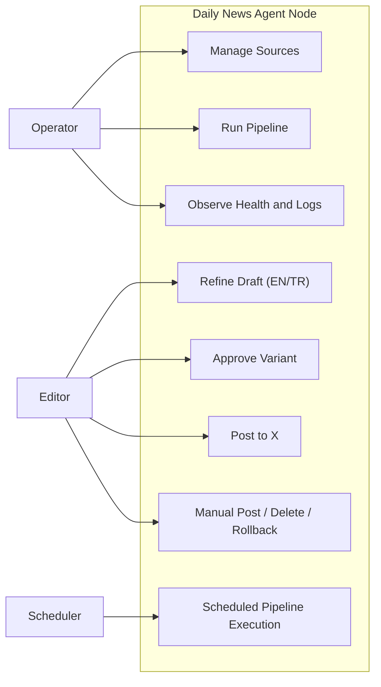
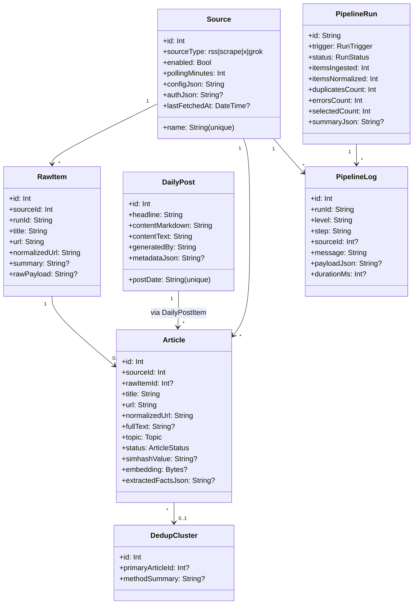
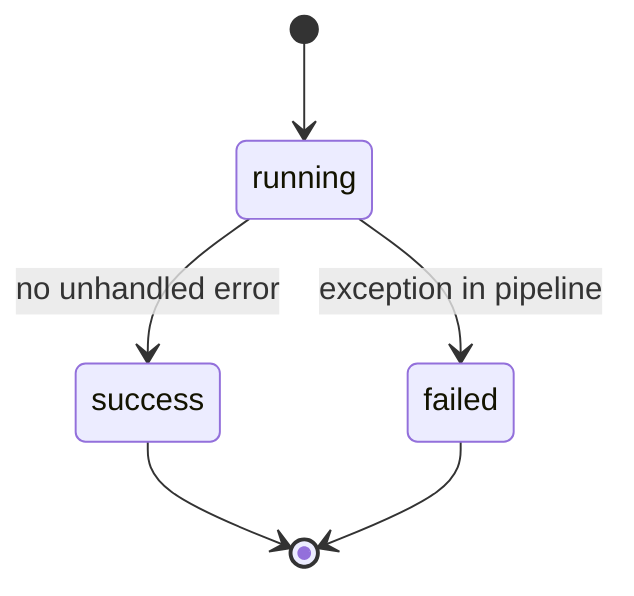
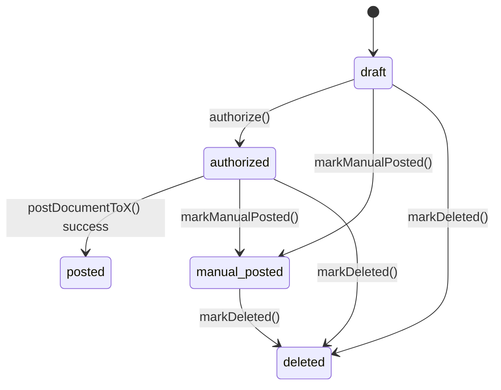
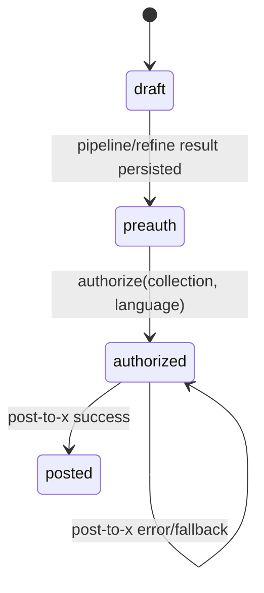
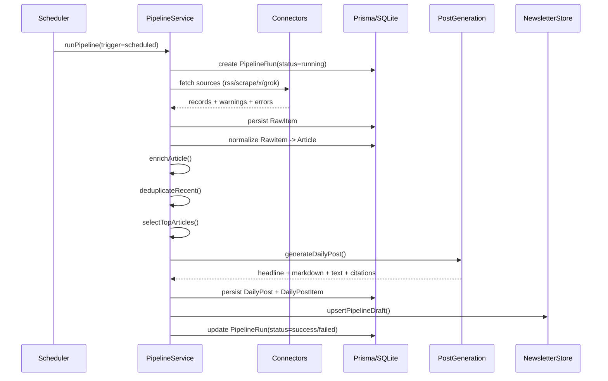
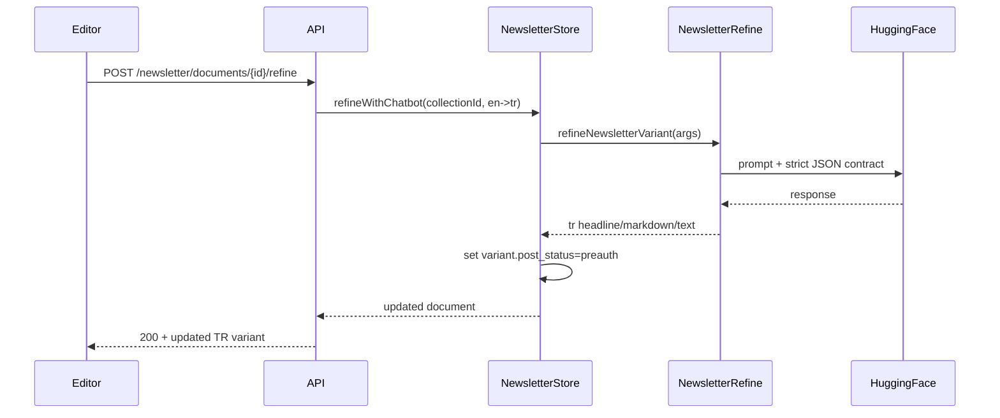
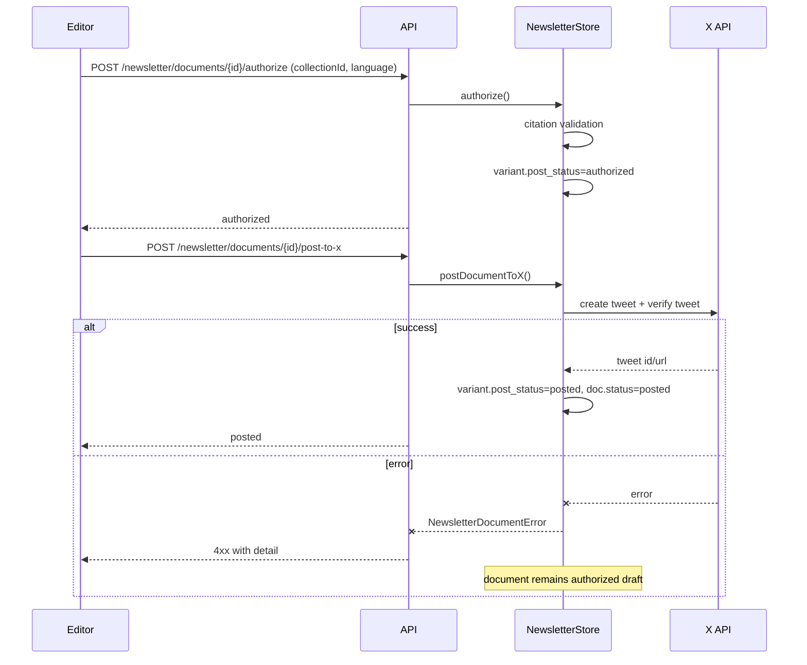

# Architecture and UML

This document describes the current Node.js implementation architecture (`src/`) and its operational model.

For field-level lineage and transformation details, see `DATA_JOURNEY.md`.

## 1) System Context

## 2) Pipeline Stages

Execution order in `runPipeline`:

1. Ingestion
2. Normalization
3. Enrichment
4. Dedup/Clustering
5. Ranking and Daily Post Generation
6. Draft persistence to newsletter NoSQL

Each stage emits persisted step logs (`PipelineLog`) with timing and payload snapshots.

## 3) Component Diagram

## 4) Use Cases

### 4.1 Actors

- Operator (manages sources, runs pipeline, monitors system)
- Editor (refines, approves, posts newsletter variants)
- Scheduler (automated daily trigger)
- External Integrations (RSS/Web/X/Grok/LLM providers)

### 4.2 Use Case Diagram

### 4.3 Use Case Details

| ID | Use Case | Trigger | Primary Outcome | Failure Mode |
|---|---|---|---|---|
| UC1 | Manage Sources | Dashboard/API | Source CRUD persisted in DB | Validation/uniqueness errors |
| UC2 | Run Pipeline | Manual API/Dashboard | New run with logs + optional draft update | Run marked failed with error log |
| UC3 | Observe Health and Logs | Dashboard/API | Runtime visibility (health/metrics/logs) | Partial probe warnings |
| UC4 | Refine Draft | Editor action | New language variant content + version entry | LLM JSON/transport failure |
| UC5 | Approve Variant | Editor action | Variant `post_status=authorized` | Citation validation fails |
| UC6 | Post to X | Editor action | X post verified + status `posted` | Integration error, stays authorized |
| UC7 | Manual lifecycle actions | Editor action | `manual_posted` or `deleted` or rollback state | Invalid transition |
| UC8 | Scheduled run | Cron trigger | Same as UC2 with trigger `scheduled` | Logged failure, scheduler continues |

## 5) Data Model (Prisma + NoSQL)

### 5.1 Relational Core (SQLite via Prisma)

### 5.2 Newsletter NoSQL Model

Newsletter documents are stored in `.runtime/newsletter_documents.json`.

Structure (simplified):

- Document-level status: `draft | authorized | posted | manual_posted | deleted`
- Collection-level data:
  - source news items
  - citation catalog
  - `language_variants[]`
- Variant-level posting state:
  - `post_status: draft | preauth | authorized | posted`
  - `approved_at`, `posted_at`
- Version history entries with payload snapshots and citation validation
- Audit trail entries

## 6) State Diagrams

### 6.1 Pipeline Run State

### 6.2 Newsletter Document State

### 6.3 Variant Posting State (Per Language)

## 7) Sequence Diagrams

### 7.1 Scheduled Pipeline Execution

### 7.2 Chat Refine to Turkish Variant

### 7.3 Approve and Post Variant with Fallback

## 8) API Surface (Current)

Grouped by responsibility:

- Health/Status
  - `GET /health`
  - `GET /health/verbose`

- Runtime Admin
  - `GET /system/config`
  - `PUT /system/config/:key`
  - `GET /system/secrets`
  - `PUT /system/secrets/:key`
  - `DELETE /system/secrets/:key`

- Sources
  - `GET /sources`
  - `GET /sources/health`
  - `POST /sources`
  - `PUT /sources/:sourceId`
  - `POST /sources/:sourceId/toggle`
  - `DELETE /sources/:sourceId`

- News/Clusters
  - `GET /articles/page`
  - `PATCH /articles/:articleId/status`
  - `GET /clusters/:clusterId`

- Pipeline
  - `POST /pipeline/run`
  - `POST /pipeline/run/async`
  - `GET /pipeline/runs/page`
  - `GET /pipeline/runs/:runId/logs/page`

- Observability
  - `GET /system/logs/recent`
  - `GET /system/metrics`
  - `GET /system/recovery`
  - `GET /stats`

- Daily Posts
  - `GET /posts/latest`
  - `GET /posts/:postDate`

- Newsletter Workflow
  - `GET /newsletter/documents/latest`
  - `GET /newsletter/documents/page`
  - `GET /newsletter/documents/:documentId`
  - `GET /newsletter/documents/:documentId/versions`
  - `POST /newsletter/documents/:documentId/save-draft`
  - `POST /newsletter/documents/:documentId/refine`
  - `POST /newsletter/documents/:documentId/authorize`
  - `POST /newsletter/documents/:documentId/post-to-x`
  - `POST /newsletter/documents/:documentId/manual-posted`
  - `POST /newsletter/documents/:documentId/delete`
  - `POST /newsletter/documents/:documentId/rollback`

## 9) Design Notes and Constraints

- Local-first persistence:
  - relational data in SQLite via Prisma
  - newsletter documents in local JSON store
- Safety:
  - scraping respects robots checks in scrape connector
  - blocked/bot-protection signals are detected and persisted
- Deterministic source traceability:
  - citation tokens (`[A1]`, `[A2]`, ...) are preserved and validated
- Polymorphic ingestion:
  - source type strategy (`rss/scrape/x/grok`) controlled by DB configuration
