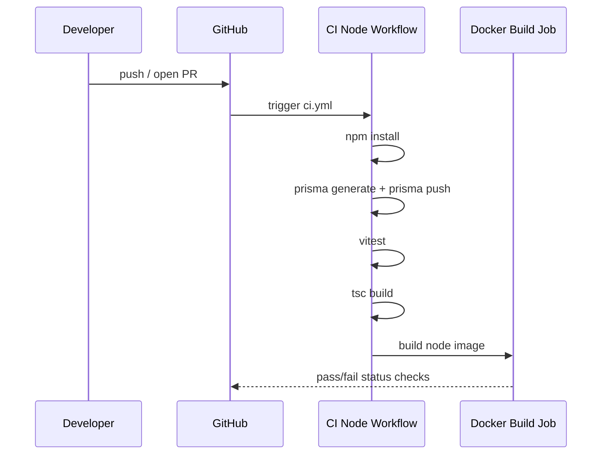

# CI/CD Guide (Node Runtime)

This document describes CI/CD for the Node implementation.

## 1) Current Workflows

### 1.1 CI/CD Workflow

File:

- `.github/workflows/ci.yml`

Triggers:

- push to `main` or `master`
- pull requests
- manual dispatch

Jobs:

1. `node-quality`
   - `npm run verify:public`
   - `npm ci`
   - `npm run prisma:generate`
   - `npm run prisma:push`
   - `npm test`
   - `npm run build`
2. `node-docker`
   - builds Docker image from `Dockerfile`
3. `gitpod-parity`
   - runs the same bootstrap commands defined for Gitpod to guarantee environment parity.

## 2) CI Sequence Diagram



## 3) Required Quality Gates

Recommended branch protection for Node delivery:

- `node-quality` must pass
- `node-docker` must pass
- at least one code review approval
- no unresolved conversations

## 4) Local CI Parity

From `/path/to/daily-news-agent`:

```bash
npm run verify:public
npm install
npm run prisma:generate
npm run prisma:push
npm test
npm run build
docker build -t daily-news-agent:local .
```

## 5) Deployment Promotion Model

Current state:

- CI validates build/test
- deployment is manual (local host / compose)

Recommended promotion flow:

1. Merge to main after CI green.
2. Build versioned Node image.
3. Deploy to target host with immutable image tag.
4. Run post-deploy health checks:
   - `/health`
   - `/health/verbose`
   - dashboard-service smoke at `http://127.0.0.1:8001/dashboard/` (separate repo)

## 6) Proposed Node Release Workflow (Gap)

Current CI validates Node quality, Docker build, and Gitpod parity.

Recommended CD extension:

- add `release-node-image.yml` with:
  - tag trigger `v*`
  - build/push `Dockerfile` image to GHCR
  - multi-arch images (`amd64`, `arm64`)
  - SBOM/provenance optional hardening

## 7) CI/CD Use Cases

| Use Case | Trigger | Expected Output |
|---|---|---|
| PR validation | pull_request | test/build status + Docker build check |
| Main branch quality gate | push main/master | repeat validation for merge safety |
| Manual check | workflow_dispatch | on-demand pipeline run |
| Release publish (target state) | git tag | versioned Node image pushed to registry |

## 8) Failure Triage

Order for debugging CI failures:

1. Dependency install issues
2. Prisma generation/schema drift
3. Test failures (logic regressions)
4. TypeScript compile failures
5. Docker build failures

Fast local reproduction:

```bash
npm test -- --run
npm run build
docker build -t daily-news-agent:ci .
```

## 9) Governance Notes

- Keep workflow runtime pinned to Node 20 for compatibility with repo scripts.
- Keep Prisma schema and tests version-controlled with code changes.
- Update CI when new runtime-critical endpoints or environment dependencies are introduced.
