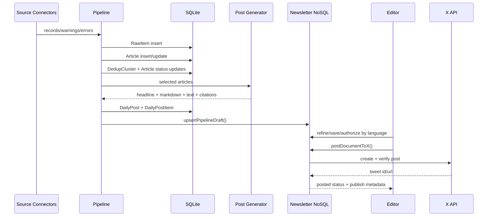
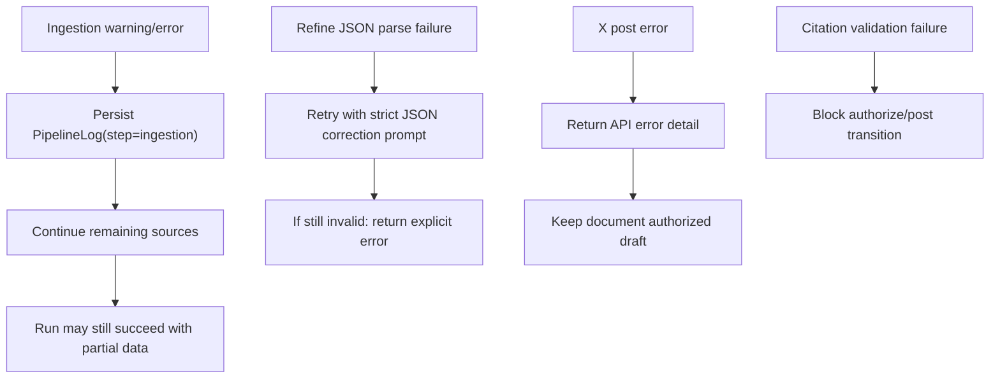

# Data Journey

This document describes end-to-end data movement, transformations, lineage IDs, and persistence boundaries in the Node runtime.

## 1) End-to-End Flow

```mermaid
flowchart LR
    S1["Sources (RSS / Scrape / X / Grok)"] --> I["Ingestion"]
    I --> R["RawItem (DB)"]
    R --> N["Normalization"]
    N --> A["Article (DB)"]
    A --> E["Enrichment (full text + facts + retrieval metadata)"]
    E --> D["Dedup + Cluster"]
    D --> K["Ranking + Selection"]
    K --> P["DailyPost + DailyPostItem (DB)"]
    P --> Q["Newsletter Draft Upsert (NoSQL)"]
    Q --> V["Language Variants + Versions + Audit"]
    V --> X["Authorize and Post to X"]
```

## 2) Stores and Boundaries

- Relational store (Prisma/SQLite):
  - `Source`, `RawItem`, `Article`, `DedupCluster`, `DailyPost`, `DailyPostItem`, `PipelineRun`, `PipelineLog`, `RelatedLink`
- Document store (local NoSQL JSON):
  - `.runtime/newsletter_documents.json`
  - newsletter lifecycle, language variants, version snapshots, audit trail, X publish status

## 3) Journey Stages

### Stage A: Source Configuration

Input:

- `Source` records with `sourceType`, `configJson`, `tagsJson`, `pollingMinutes`, `enabled`

Output:

- Active source set for current run

Key fields:

- `source.id`
- `source.sourceType`

### Stage B: Ingestion

Input:

- enabled sources due by polling schedule

Transformation:

- connector fetch
- robots/selector/URL filtering (scrape)
- connector warnings/errors captured

Output:

- `RawItem[]` persisted for `runId`

Key lineage:

- `PipelineRun.id` -> `RawItem.runId`
- `RawItem.sourceId` -> `Source.id`

### Stage C: Normalization

Input:

- `RawItem` for run

Transformation:

- normalize URL/domain
- map source tags to initial topic
- create canonical article row

Output:

- `Article[]`

Key lineage:

- `Article.rawItemId` -> `RawItem.id`
- `Article.sourceId` -> `Source.id`

### Stage D: Enrichment

Input:

- new `Article` rows from run

Transformation:

- extract full readable text
- detect language
- classify topic
- extract facts (who/what/numbers)
- attach retrieval metadata (`blocked`, `reason`, `resolved_url`)
- optional related links (Serper)

Output:

- enriched `Article` updates
- optional `RelatedLink[]`

### Stage E: Deduplication and Clustering

Input:

- recent articles (default horizon 3 days)

Signals:

- normalized URL equality
- title similarity
- SimHash distance
- embedding cosine similarity

Output:

- `DedupCluster[]`
- article status transitions (`new` or `duplicate`)

Key lineage:

- `Article.clusterId` -> `DedupCluster.id`
- `DedupCluster.primaryArticleId`

### Stage F: Ranking and Selection

Input:

- primary articles from clusters

Transformation:

- priority scoring by entity/topic, recency, facts richness, cluster impact
- select bounded top set

Output:

- selected article list
- `Article.status=selected` for chosen entries

### Stage G: Daily Post Generation

Input:

- selected articles

Transformation:

- generate one post (Markdown + text)
- assign deterministic citation catalog (`A1..An`)
- enforce citation coverage

Output:

- `DailyPost`
- `DailyPostItem[]`

Key lineage:

- `DailyPostItem.postId` -> `DailyPost.id`
- `DailyPostItem.articleId` -> `Article.id`
- `DailyPost.metadataJson.citation_catalog[]`

### Stage H: Newsletter Draft Persistence

Input:

- generated post payload + selected source news + citation catalog

Transformation:

- upsert document by `daily_post_id`/`post_date`
- create or update collection `collection-YYYY-MM-DD`
- create/update language variant
- append version snapshot
- append audit event

Output:

- newsletter document in NoSQL with status `draft`

Key lineage:

- `document.pipeline_run_id` -> `PipelineRun.id`
- `document.daily_post_id` -> `DailyPost.id`
- `collection.news[].article_id` -> `Article.id`

### Stage I: Editorial Workflow and Posting

Input:

- draft document + language variants

Transformation:

- save draft edits
- chatbot refine to target language
- citation validation
- language-specific authorize
- post to X with verification

Output:

- document and variant status transitions
- X publish metadata (tweet id/url/correlation)

Status model:

- Document: `draft | authorized | posted | manual_posted | deleted`
- Variant: `draft | preauth | authorized | posted`

## 4) Lineage ID Map

| ID | Origin | Used In |
|---|---|---|
| `runId` | Pipeline start | `PipelineRun`, `PipelineLog`, `RawItem`, newsletter `pipeline_run_id` |
| `sourceId` | Source table | `RawItem`, `Article`, `PipelineLog` |
| `rawItemId` | Raw ingest row | `Article.rawItemId` |
| `articleId` | Article row | dedup clusters, daily post items, newsletter news entries |
| `clusterId` | Dedup cluster | `Article.clusterId` |
| `dailyPostId` | Generated post | newsletter document (`daily_post_id`) |
| `documentId` | Newsletter NoSQL | all editorial and posting actions |
| `collectionId` | NoSQL collection (`collection-YYYY-MM-DD`) | variant selection, approval, posting |
| `versionId` | NoSQL version snapshot | rollback and governance |
| `citation_id` | deterministic `A#` token | source-reference traceability in content |
| `correlation_id` | X publish write | publish audit tracking |
| `dedupe_key` | publish idempotency hash | repost protection |

## 5) Sequence Diagram: Data Journey (Happy Path)

## 6) Error and Recovery Journey

## 7) Data Quality and Guardrails

- Scrape connector supports allow/deny patterns and same-domain filters.
- Retrieval metadata records blocking/bot-protection signals.
- Citation coverage is validated before authorization/posting.
- Per-language approval required for posting that specific language variant.
- Pipeline and step logs persist counts, durations, warnings, and errors.

## 8) Audit and Debug Entry Points

- Runs:
  - `GET /pipeline/runs/page`
- Run logs:
  - `GET /pipeline/runs/:runId/logs/page`
- Latest post:
  - `GET /posts/latest`
- Newsletter document:
  - `GET /newsletter/documents/:documentId`
- Versions:
  - `GET /newsletter/documents/:documentId/versions`
- Health probes:
  - `GET /health/verbose`

## 9) Retention and Lifecycle Notes

- SQLite data retention is currently unbounded unless manually pruned.
- Newsletter documents persist across runs in local JSON store.
- Version history keeps recent history with bounded append logic in store service.
- Deleted newsletter status clears collection payload intentionally.
