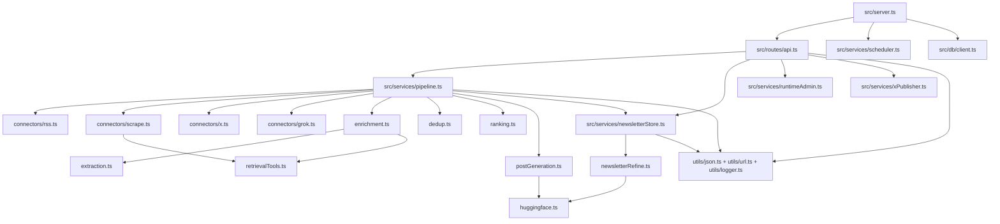
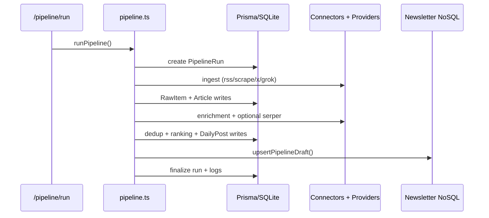
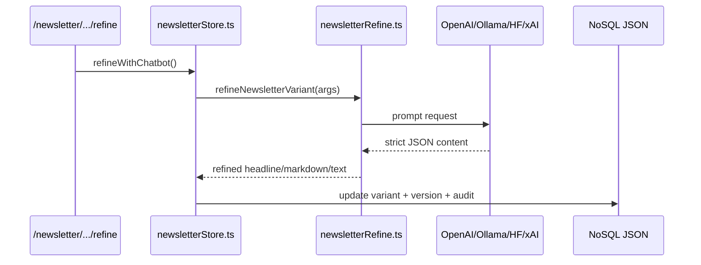

# Dependency Map

This document describes package-level and module-level dependencies for the Node.js runtime.

## 1) Package Dependency Layers

### Runtime core
- `express`, `cors`
- `dotenv`, `zod`
- `pino`

### Data layer
- `@prisma/client`
- `prisma` (dev/runtime tooling)

### Connector and extraction layer
- `axios`
- `rss-parser`
- `cheerio`
- `@mozilla/readability`
- `jsdom`
- `playwright` (optional JS-rendered scraping)

### Scheduling and orchestration
- `node-cron`

### LLM/provider layer
- `openai`
- `axios` (xAI, Hugging Face, Ollama HTTP calls)

### Tooling and tests
- `typescript`, `tsx`
- `vitest`
- `@types/*`

## 2) Internal Module Dependency Graph

## 3) Critical Path Dependencies

### Request path: run pipeline

### Request path: refine newsletter

## 4) Optional vs Required Dependencies

| Dependency | Required for base run | Required for full feature set |
|---|---|---|
| `express`, `@prisma/client`, `node-cron`, `axios`, `zod` | Yes | Yes |
| `playwright` | No | Needed for JS-render scrape sources |
| `openai` | No | Needed only when `LLM_PROVIDER=openai` |
| Hugging Face/xAI/Ollama HTTP endpoints | No | Needed based on selected provider |
| X credentials | No | Needed for X ingestion and publish |
| Serper API key | No | Needed for related-links enrichment |

## 5) Dependency Risk Notes

- `playwright` increases image size and cold-start time; keep optional at source level (`jsRender=true` only where needed).
- Provider SDK/API versions should be pinned and reviewed before major upgrades.
- Prisma schema changes should be coordinated with `prisma db push` and seed/test runs.

## 6) Upgrade Strategy

1. Check current graph: `npm ls --depth=1`
2. Review available updates: `npm outdated`
3. Upgrade incrementally by layer:
   - tooling/dev
   - connectors/parsers
   - DB/runtime
   - provider SDKs
4. Validate with:
   - `npm run build`
   - `npm test`
   - `npm run run:pipeline`
   - `GET /health/verbose`
