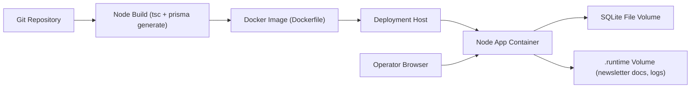
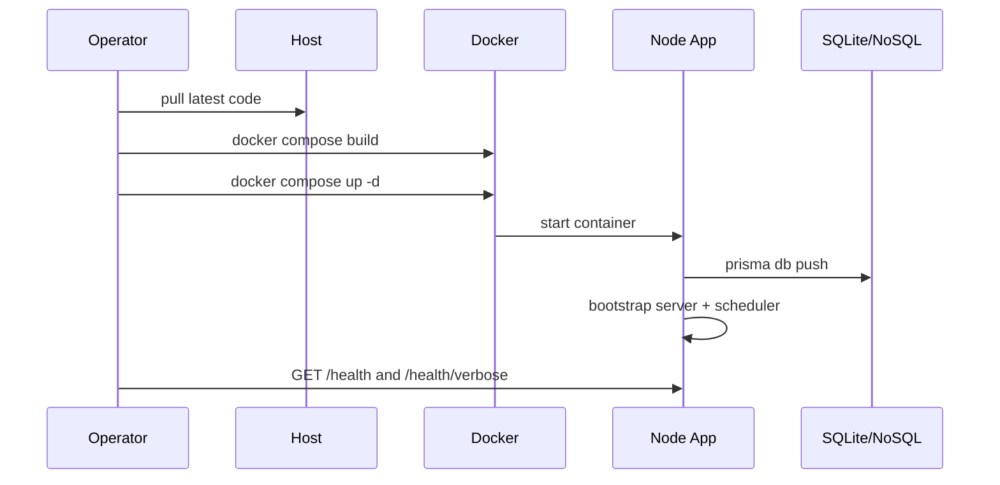

# Deployment Guide

This guide covers local and server-style deployment of the Node runtime.

## 1) Deployment Targets

- Developer local machine (no Docker)
- Single-host Docker Compose deployment
- GitHub Actions build validation (CI)

Current repository is Node runtime only.

## 2) Deployment Architecture



## 3) Preconditions

- Node 20+ (for non-Docker)
- Docker + Docker Compose (for container mode)
- `.env` configured from `.env.example`
- `HUGGINGFACE_API_KEY` and model config for Turkish refine
- X credentials configured if posting to X is required

## 4) Non-Docker Deployment

From `/path/to/daily-news-agent`:

```bash
cp .env.example .env
npm install
npm run prisma:generate
npm run prisma:push
npm run build
npm run start
```

Validate:

```bash
curl http://127.0.0.1:8000/health
curl http://127.0.0.1:8000/health/verbose
```

UI is served by the separate dashboard-service repository:

- `http://127.0.0.1:8001/dashboard/`

To run both services together in local dev:

```bash
cd /path/to/daily-news-agent
npm run dev:with-dashboard
```

## 5) Docker Deployment

`docker-compose.yml` mounts persistence volumes:

- `./data:/app/data`
- `./.runtime:/app/.runtime`

Run:

```bash
cd /path/to/daily-news-agent
cp .env.example .env
docker compose up --build -d
```

Stop:

```bash
docker compose down
```

Check:

```bash
docker compose ps
curl http://127.0.0.1:8000/health
```

## 6) Deployment Sequence



## 7) Persistent Data and Backups

Persist these paths:

- SQLite DB path (Prisma-resolved path; verify actual file on host)
- `.runtime/newsletter_documents.json`
- optional `.runtime` logs and artifacts

Backup recommendation:

1. Stop app (or ensure no writes during snapshot).
2. Copy DB file and `.runtime/newsletter_documents.json`.
3. Store timestamped archive.

## 8) Rollback Plan

For source-based deployments:

1. Checkout previous commit/tag.
2. Rebuild (`npm run build` or docker build).
3. Restart app.
4. Keep same persisted data if schema-compatible.

For schema risk:

1. Backup DB and newsletter JSON before rollout.
2. Restore backup if rollback is required.

## 9) Security and Hardening Checklist

- Rotate API keys and tokens regularly.
- Do not commit `.env`.
- Restrict network exposure to required ports only.
- Use a reverse proxy/TLS for internet-facing deployment.
- Limit filesystem permissions on data and runtime directories.
- Monitor `/health/verbose` integration warnings.
- Keep internal JWT service private-only (`/authenticate`, `/logout`, `/business`) and set strong `INTERNAL_AUTH_JWT_SECRET`.
- Prefer `INTERNAL_AUTH_PASSWORD_HASH` (PBKDF2 format) over plaintext auth password.
- For Keycloak gateway mode, verify `KEYCLOAK_*` values and ensure Keycloak client is configured as public client with PKCE (`S256`) and correct Web Origins/Redirect URIs (`/login/`).

## 10) Production Caveats

- Single-process, single-host model by default.
- SQLite is suitable for local-first and small deployments; for scale, migrate DB provider.
- X posting requires full credential set and bearer verification flow.
- LLM provider availability impacts refine/generation quality; fallback paths exist for post generation but refine expects strict JSON output.

## 11) Gitpod Deployment

Use Gitpod for cloud workspace deployment and preview:

1. Open:
   - `https://gitpod.io/#https://github.com/COPUR/daily-news-agent`
2. Wait for `.gitpod.yml` bootstrap:
   - copies `.env` from `.env.example` when missing
   - creates `data/` and `.runtime/`
   - runs `npm ci`, `npm run prisma:generate`, `npm run prisma:push`
   - starts app with `npm run dev`
3. Validate:
   - `curl http://127.0.0.1:8000/health`
   - `curl http://127.0.0.1:8000/health/verbose`
4. Open dashboard service (separate repo):
   - `http://127.0.0.1:8001/dashboard/`

Set provider secrets in Gitpod workspace/project variables (for example `OPENAI_API_KEY`, `HUGGINGFACE_API_KEY`, `XAI_API_KEY`, X credentials, `SERPER_API_KEY`) and restart the workspace after updates.

Persistence note:

- `data/` and `.runtime/` live inside the workspace filesystem. Keep backups/export copies if you need data beyond workspace lifecycle.
