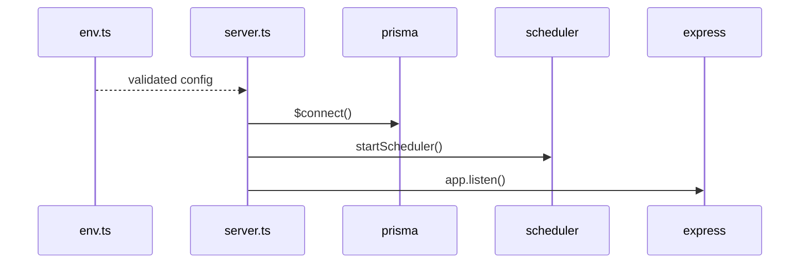

# Implementation Documentation

This is the implementation-level guide for the active Node.js runtime.

## 1) Implementation Scope

Primary runtime paths:
- `src/server.ts`
- `src/routes/api.ts`
- `src/services/*`
- `src/config/env.ts`
- `prisma/schema.prisma`
- `public/dashboard/*`

Primary persistence:
- Relational: SQLite via Prisma
- Document: `.runtime/newsletter_documents.json`

## 2) Runtime Bootstrap

1. Load environment schema (`src/config/env.ts`)
2. Connect Prisma (`src/db/client.ts`)
3. Start scheduler (`src/services/scheduler.ts`)
4. Start Express server and static dashboard (`src/server.ts`)

### Boot sequence diagram



## 3) Service Implementation Details

### 3.1 API Router (`src/routes/api.ts`)

Main route groups:
- Health and diagnostics: `/health`, `/health/verbose`
- Runtime admin: `/system/config`, `/system/secrets`
- Source CRUD/health: `/sources`, `/sources/health`
- News and clusters: `/articles/page`, `/articles/:id/status`, `/clusters/:id`
- Pipeline control and logs: `/pipeline/run`, `/pipeline/run/async`, `/pipeline/runs/*`
- Observability: `/system/metrics`, `/system/recovery`, `/system/logs/recent`, `/stats`
- Daily posts: `/posts/latest`, `/posts/:postDate`
- Newsletter workflow: `/newsletter/documents/*`

Design choices:
- Thin controller, heavy service-layer logic
- Structured error payloads (`{ detail: ... }`)
- Runtime probes aggregated in `health/verbose`

### 3.2 Pipeline (`src/services/pipeline.ts`)

Execution stages:
1. `ingestSources` (RSS/scrape/X/Grok connectors)
2. `normalizeRawItems` (RawItem -> Article)
3. `enrichArticles` (full-text, facts, language/topic)
4. `deduplicateRecent`
5. `rankAndGeneratePost`
6. `newsletterStore().upsertPipelineDraft`

Guarantees:
- A `PipelineRun` row is created before execution.
- Each stage persists logs in `PipelineLog`.
- Run finalization always updates success/failure and counters.

### 3.3 Connectors

- `rss.ts`: RSS parsing and item normalization.
- `scrape.ts`: selector-based list crawling with robots checks.
- `x.ts`: official X API ingestion (when bearer token configured).
- `grok.ts`: xAI prompt-driven discovery of EV news links.

Pattern usage:
- `retrievalTools.ts` implements reusable fetch patterns inspired by workflow tooling:
  - `textRetrievalTool`
  - `urlRetrievalTool`
- Block detection and resolved URL tracking are passed into enrichment metadata.

### 3.4 Enrichment (`src/services/enrichment.ts`)

Responsibilities:
- Full text extraction (`extraction.ts`)
- Topic classification and fact extraction
- Retrieval metadata persistence (`blocked`, `reason`, `resolved_url`)
- Optional related links enrichment via Serper

### 3.5 Dedup + Ranking

- `dedup.ts`: URL, title, SimHash, embedding similarity and cluster assignment.
- `ranking.ts`: weighted topic/entity scoring and top-N selection bounded by env config.

### 3.6 Daily Post and Refinement

- `postGeneration.ts`
  - Builds deterministic `citation_catalog` (`A1..An`)
  - Calls configured provider or falls back rule-based
  - Enforces citation coverage in markdown/text
- `newsletterRefine.ts`
  - Provider-agnostic refine prompt and JSON parsing
  - Keeps citation tokens stable
  - Supports TR/EN editing flow

### 3.7 Newsletter Store (`src/services/newsletterStore.ts`)

Core capabilities:
- Upsert pipeline draft by `post_date`/`daily_post_id`
- Maintain per-language variants
- Validate citation coverage before approval/post
- Append version history snapshots
- Append audit transaction events
- Handle status transitions:
  - Document: `draft -> authorized -> posted` (+ `manual_posted`, `deleted`)
  - Variant: `draft -> preauth -> authorized -> posted`

### 3.8 X Publisher (`src/services/xPublisher.ts`)

Flow:
1. Build constrained post text (<= 280 chars)
2. Create tweet via X API
3. Verify tweet exists by id
4. Return publish metadata (id, URL, timestamp)

Failure behavior:
- Throws typed errors (`XPublishError`)
- Caller preserves safe state (authorized draft not lost)

## 4) Dashboard Implementation

Files:
- `public/dashboard/index.html`
- `public/dashboard/app.js`
- `public/dashboard/style.css`

Tabs implemented:
- Overview, Sources, News, Observability, Newsletter, Version Studio, Config & Secrets, Logs

Version Studio behavior:
- Selects `versionId`
- Displays payload snapshot, metadata, inferred transaction events, and related integration logs

## 5) Data Persistence Implementation

Relational (Prisma models):
- `Source`, `RawItem`, `Article`, `DedupCluster`, `RelatedLink`
- `DailyPost`, `DailyPostItem`
- `PipelineRun`, `PipelineLog`

Document store schema includes:
- document status and metadata
- collections with `news[]`, `citation_catalog[]`, `language_variants[]`
- `versions[]` snapshots
- `audit[]` transaction history

## 6) Error Recovery and Idempotency

Implemented patterns:
- Stage-level error logging with persisted run summary
- Connector-level warnings/errors without stopping entire run where safe
- Re-run support with `forcePost` behavior
- Posting failures keep draft/authorized state (no destructive rollback)
- Citation validation gates authorization/post transitions

## 7) Build, Test, Run

From `/path/to/daily-news-agent`:

```bash
npm install
npm run prisma:generate
npm run prisma:push
npm run seed
npm run build
npm test
npm run dev
```

Sanity checks:
- `GET /health`
- `GET /health/verbose`
- `POST /pipeline/run/async`
- Dashboard at `/dashboard/`

## 8) Extension Guide

### Add a new source connector

1. Add `SourceType` enum value in Prisma schema.
2. Implement `src/services/connectors/<new>.ts` returning `ConnectorResult`.
3. Wire connector in `ingestSources()` switch.
4. Add source config handling in UI/API docs.
5. Add tests and health probe if external credentials are required.

### Add a new LLM provider

1. Extend `LLM_PROVIDER` enum in `env.ts`.
2. Implement provider call in `postGeneration.ts` and `newsletterRefine.ts`.
3. Add probe in `/health/verbose`.
4. Add runtime config/secrets docs and UI keys.

### Add a new editorial status rule

1. Update status transition checks in `newsletterStore.ts`.
2. Preserve backward compatibility for existing documents.
3. Add version/audit annotation for the new action.
4. Add regression tests for valid/invalid transitions.

## 9) Related Documentation

- `ARCHITECTURE_UML.md`
- `DATA_JOURNEY.md`
- `RUNTIME_OPERATIONS.md`
- `INTEGRATION_MAP.md`
- `DEPENDENCY_MAP.md`
