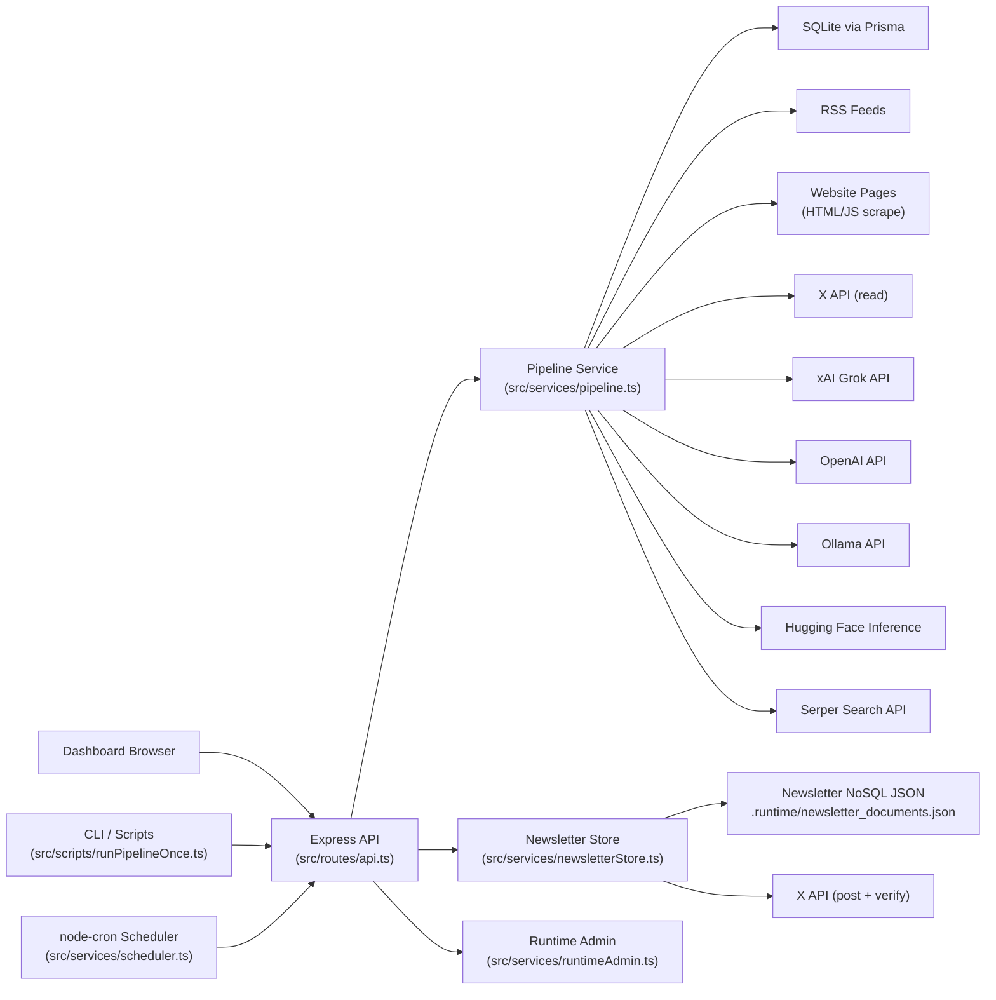
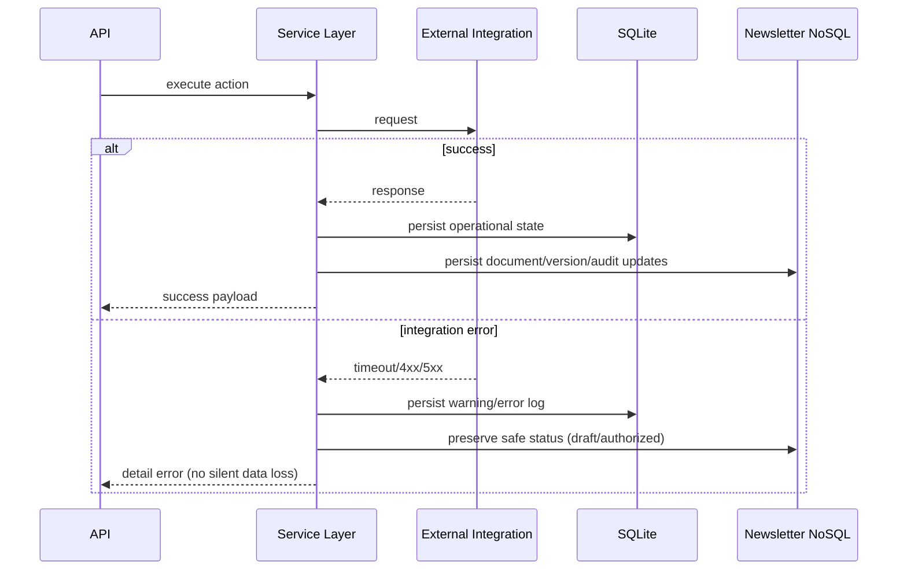

# Integration Map

This document maps all runtime integrations for the Node.js implementation, including inbound channels, outbound providers, and audit/health coverage.

## 1) Integration Boundary

## 2) Inbound Integration Points

| Source | Protocol | Entry | Purpose |
|---|---|---|---|
| Dashboard UI | HTTP | `/dashboard/` static assets + API calls | Operator/editor workflows |
| CLI | Node script | `npm run run:pipeline` | One-off pipeline execution |
| Scheduler | In-process cron | `startScheduler()` | Daily automatic pipeline trigger |
| API callers | HTTP/JSON | `/pipeline/*`, `/sources/*`, `/newsletter/*` | Manual/automation control |

## 3) Outbound Integration Map

| Integration | Runtime Module | Config Keys | Health Probe ID | Degrade/Fallback Behavior |
|---|---|---|---|---|
| RSS feeds | `src/services/connectors/rss.ts` | Source `configJson.url` | `connectors.sources` | Source-level warning/error; run continues |
| Web scraping (HTML) | `src/services/connectors/scrape.ts` + `retrievalTools.ts` | Source selectors/allow/deny | `connectors.sources` | Empty results or warnings; run continues |
| Web scraping (JS render) | `retrievalTools.ts` (Playwright) | `sourceConfig.jsRender` | `connectors.sources` | `js_render_failed` captured in retrieval metadata |
| X read API | `src/services/connectors/x.ts` | `TWITTER_BEARER_TOKEN` | `integration.x.read` | Connector disabled warning when token missing |
| xAI Grok search | `src/services/connectors/grok.ts` | `XAI_API_KEY`, `XAI_BASE_URL`, `XAI_MODEL` | `llm.xai` | Connector disabled if key missing |
| OpenAI generation | `postGeneration.ts`, `newsletterRefine.ts` | `OPENAI_API_KEY`, `OPENAI_MODEL` | `llm.openai` | Falls back to other provider or rule-based post |
| Hugging Face generation/refine | `huggingface.ts`, `newsletterRefine.ts` | `HUGGINGFACE_API_KEY`, `HUGGINGFACE_MODEL_ID` | `llm.huggingface` | Refine fails fast if configured but unavailable |
| Ollama generation/refine | `postGeneration.ts`, `newsletterRefine.ts` | `OLLAMA_BASE_URL`, `OLLAMA_MODEL` | `llm.ollama` | Falls back when unavailable |
| Serper related links | `enrichment.ts` | `SERPER_API_KEY`, `SERPER_ENDPOINT` | `integration.serper` | Optional enrichment skipped silently on failure |
| X post API | `xPublisher.ts` | `TWITTER_*` + `TWITTER_BEARER_TOKEN` | `integration.x.post` | Returns error; document remains authorized draft |

## 4) API-to-Integration Route Map

| API Route Group | Primary Service | Downstream Integrations |
|---|---|---|
| `/pipeline/run`, `/pipeline/run/async` | `runPipeline` | Source connectors, LLM providers, Serper, DB, newsletter NoSQL |
| `/sources/*` | Source CRUD + health summaries | DB |
| `/newsletter/documents/:id/refine` | `refineWithChatbot` | OpenAI/Ollama/HuggingFace/xAI (based on provider) |
| `/newsletter/documents/:id/post-to-x` | `postDocumentToX` | X post create+verify API |
| `/health/verbose` | `timedProbe` checks | DB, scheduler, newsletter store, LLM endpoints, X, Serper |
| `/system/config`, `/system/secrets` | runtime admin | `.env` persistence |

## 5) Integration Error and Recovery Paths

## 6) Observability Coverage Matrix

| Concern | Source |
|---|---|
| Integration readiness | `GET /health/verbose` check blocks |
| Request/step timing | `PipelineLog.durationMs` |
| Integration failures per run | `PipelineLog` level `error` + step metadata |
| Newsletter transaction history | NoSQL `audit[]` entries |
| Version-level payload snapshots | NoSQL `versions[]` entries |
| Cross-system posting traceability | publish metadata (`tweet_id`, `correlation_id`, URL) |

## 7) Security/Compliance Notes

- Scrape connector consults `robots.txt` and skips disallowed paths.
- User-agent is configurable (`USER_AGENT`) and rate limiting is applied via `REQUEST_RATE_LIMIT_SECONDS`.
- No paywall/auth bypass logic is implemented.
- Secrets are not returned in plain text from `/system/secrets`.
