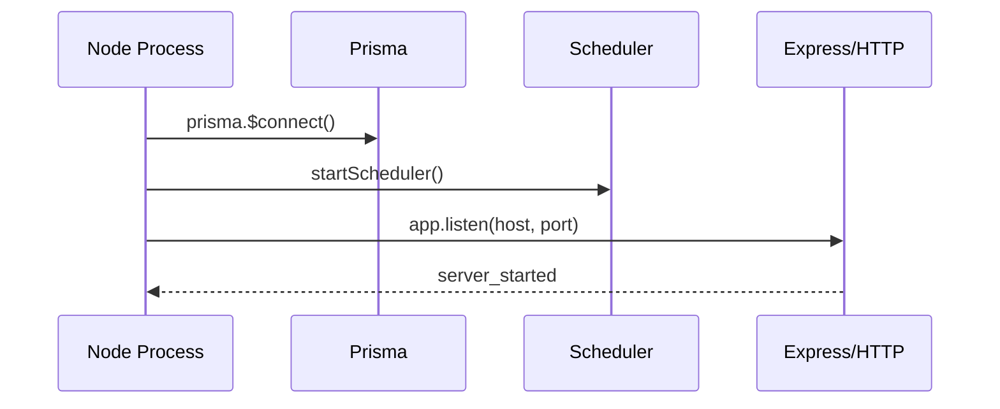
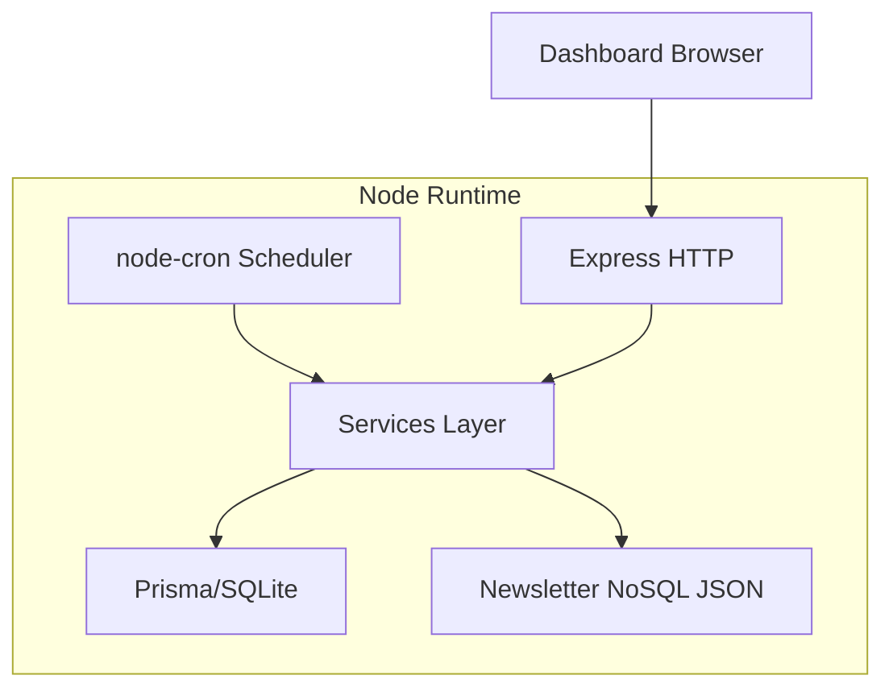

# Runtime Operations

This document describes how the Node runtime behaves in development and production-like local operation.

## 1) Runtime Topology

Single process:

- Express server (`src/server.ts`)
- API router (`src/routes/api.ts`)
- Scheduler (`src/services/scheduler.ts`)
- Prisma client (`src/db/client.ts`)
- Static dashboard files (`public/dashboard`)

### Startup Sequence



## 2) Data and File Paths

Primary local stores:

- SQLite (Prisma): `DATABASE_URL` (default `file:./data/ev_news_node.db`)
- Newsletter NoSQL JSON: `.runtime/newsletter_documents.json`
- Runtime logs/screenshots/etc: `.runtime/`

Important note:

- With Prisma + SQLite, relative `file:` paths are resolved from Prisma schema context.
- In current setup, the active DB commonly appears at:
  - `prisma/data/ev_news_node.db`

## 3) Core Commands

From `/path/to/daily-news-agent`:

```bash
npm install
npm run prisma:generate
npm run prisma:push
npm run seed
npm run dev
```

Production-like:

```bash
npm run build
npm run start
```

One-off pipeline:

```bash
npm run run:pipeline
```

## 4) Health and Observability

### 4.1 Health Endpoints

- `GET /health`
  - basic liveness
- `GET /health/verbose`
  - deep probes for DB, scheduler, newsletter store, providers, and integrations

### 4.2 Verbose Health Checks

Typical check IDs:

- `database.prisma`
- `scheduler.cron`
- `storage.newsletter_nosql`
- `connectors.sources`
- `pipeline.latest_run`
- `llm.openai`
- `llm.xai`
- `llm.huggingface`
- `llm.ollama`
- `integration.x.read`
- `integration.x.post`
- `integration.serper`

### 4.3 Metrics and Logs

- `GET /system/metrics?days=14`
- `GET /system/recovery?days=14`
- `GET /system/logs/recent?limit=100&level=...`
- `GET /pipeline/runs/:runId/logs/page`

## 5) Scheduler Behavior

- Cron expression: `${DAILY_POST_MINUTE_UTC} ${DAILY_POST_HOUR_UTC} * * *` in UTC.
- Trigger type persisted as `scheduled`.
- Scheduler status available through `schedulerStatus()` and `/health/verbose`.

## 6) Runtime Configuration and Secrets

API-managed runtime params:

- `GET /system/config`
- `PUT /system/config/:key`

Secrets:

- `GET /system/secrets`
- `PUT /system/secrets/:key`
- `DELETE /system/secrets/:key`

Changes are persisted to `.env`.
Long-lived modules may require restart after updates.

## 7) Pipeline Runtime Detail

Main stages and emitted logs:

1. ingestion
2. normalization
3. enrichment
4. dedup
5. post_generation

Each stage emits:

- `level`
- `step`
- `message`
- optional `durationMs`
- optional structured `payloadJson`

## 8) Newsletter Runtime Lifecycle

Document-level lifecycle:

- `draft -> authorized -> posted`
- plus: `manual_posted`, `deleted`

Variant-level lifecycle (per language):

- `draft -> preauth -> authorized -> posted`

Runtime behavior:

- Pipeline and refine actions set variant to `preauth`.
- Approval can target specific `collectionId + language`.
- Posting to X requires language variant `authorized`.
- X publish failure returns error and keeps document authorized draft.

## 9) Common Operational Playbooks

### 9.1 API not reachable

1. Check process and port:
   - `lsof -i :8000`
2. Check basic health:
   - `curl http://127.0.0.1:8000/health`
3. If needed:
   - restart server (`npm run dev` or `npm run start`)

### 9.2 Provider failures (translation/post generation)

1. `GET /health/verbose`
2. Confirm:
   - `LLM_PROVIDER`
   - provider key exists in secrets
3. Retry refine/post operation

### 9.3 X posting fails

Expected with missing credentials:

- `integration.x.post` in health shows warning
- Post endpoint returns detail error
- Document remains authorized and not posted

### 9.4 Scrape source returns empty

1. Inspect source config (`/sources`)
2. Review ingestion warnings/errors in run logs
3. Validate selector/allow/deny patterns
4. Verify robots/network access and optional JS rendering

## 10) Runtime Diagram (Request + Background)



## 11) Operational Baseline Checklist

- `.env` exists and required keys are set.
- `npm run prisma:push` completed.
- `/health` is `ok`.
- `/health/verbose` has no `fail` checks.
- At least one enabled source exists.
- Pipeline run produces `PipelineRun` and `PipelineLog` records.
